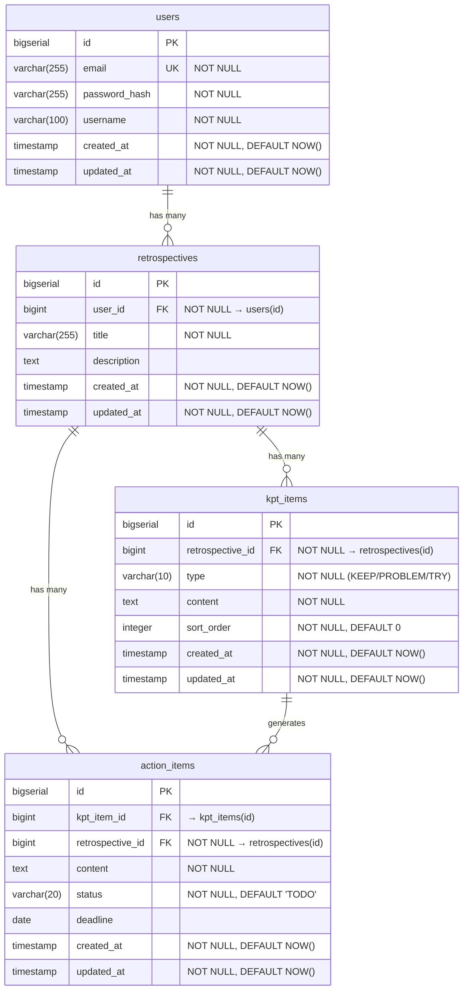

# ER 図 — MyRetrospective

## テーブル概要

| テーブル | 説明 |
|---|---|
| `users` | ユーザーアカウント。メール + パスワード認証 |
| `retrospectives` | 振り返りセッション。ユーザーごとに複数作成可能 |
| `kpt_items` | KPT（Keep / Problem / Try）の各項目 |
| `action_items` | Try から派生するアクションアイテム（Phase 3 で本格利用） |

## インデックス

| テーブル | カラム | 用途 |
|---|---|---|
| `retrospectives` | `user_id` | ユーザーの振り返り一覧取得 |
| `kpt_items` | `retrospective_id` | 振り返りの KPT 一覧取得 |
| `action_items` | `retrospective_id` | 振り返りのアクション一覧取得 |
| `action_items` | `kpt_item_id` | KPT アイテムに紐づくアクション取得 |
